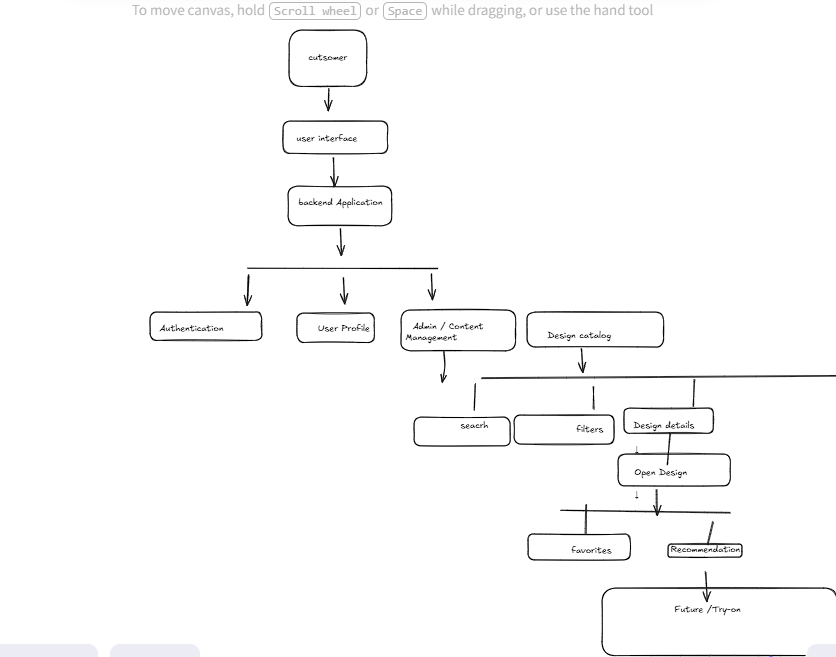

# Imagine Henna - High Level Architecture

## Purpose

This document describes the high-level architecture of Imagine Henna MVP.

The goal is to provide a shared understanding of how the major system components interact before implementation begins.

---

# System Context

Imagine Henna is a decision-support platform that helps users confidently choose mehendi designs before visiting an artist.

The MVP focuses on:

- Browsing designs
- Searching designs
- Filtering by occasion, style and coverage
- Viewing design details
- Saving favourite designs
- Recommendation support

---

# High-Level Architecture

---

# Major Components

## User Interface

Provides the interface where customers interact with the platform.

Responsibilities:

- Browse designs
- Search
- Apply filters
- View recommendations
- Save favourites

---

## Backend Application

Acts as the central coordinator of the system.

Responsibilities:

- Process requests
- Business logic
- Communicate with database
- Authentication
- Recommendation logic

---

## Authentication Module

Responsible for:

- User registration
- Login
- Session validation

---

## User Profile

Stores user information and preferences.

Future recommendations will use this information.

---

## Admin / Content Management

Used by administrators to manage the curated design catalog.

Responsibilities:

- Add new designs
- Edit metadata
- Maintain data quality

---

## Design Catalog

Core business module of the platform.

Responsibilities:

- Store mehendi designs
- Organize metadata
- Support searching and filtering

---

## Search

Allows users to quickly locate relevant designs.

---

## Filters

Allows narrowing results using:

- Occasion
- Style
- Coverage

---

## Design Details

Displays complete information about a selected design.

---

## Favourites

Allows users to save preferred designs.

---

## Recommendation Engine

Suggests suitable designs based on user preferences and design metadata.

Version 1 focuses on explainable recommendations using metadata.

---

## Future Module

Virtual Try-On

This module is intentionally excluded from MVP and planned for a later phase.

---

# Architecture Principles

The system follows the Engineering OS principles:

- Product before Technology
- Data before AI
- Simplicity before Scale
- Modular Monolith Architecture
- Build for Explainability

## Architectural Style

Imagine Henna follows a Modular Monolith architecture.

Each module has a single business responsibility and communicates through well-defined interfaces within the same application.

This approach keeps the MVP simple while allowing future extraction into microservices if justified by operational needs.